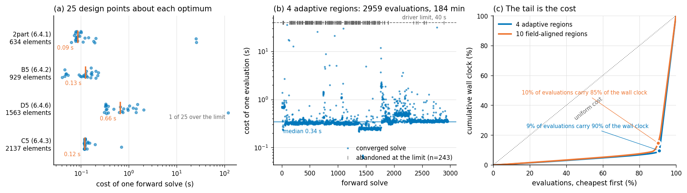
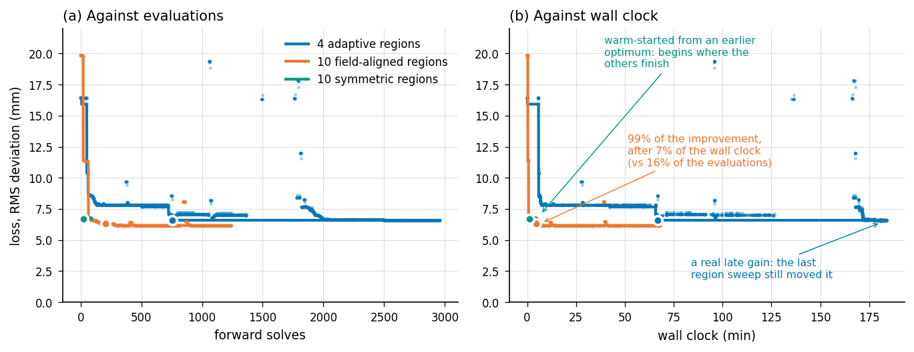

# 6.5.1 Computational time

All timings in this section were measured on a single workstation with an Intel Xeon Gold 5412U, twenty cores and 16 GB of memory, with the forward solver compiled at -O3 and using CHOLMOD for the sparse factorisation. The forward solve is serial. One objective evaluation occupies one core, and the other nineteen stay idle unless several evaluations are dispatched at once, which the present implementation does not do.

The cost of the workflow is set almost entirely by the inner forward solve of Section 6.3.7. Everything outside it is either done once — the force density optimisation, the directional field, the initial region partition — or is arithmetic on a design vector of at most thirty entries. The question is therefore what one forward solve costs, how many of them a strategy needs, and why the two do not multiply to the observed wall clock.

## What one forward solve costs

Figure 6.29a gives the cost of a solve on each of the four case-study meshes, sampled at twenty-five design points drawn within ±10% of the recorded optimum — the neighbourhood a finite-difference L-BFGS-B actually visits. The median cost is 0.09 s on the creased shell (634 elements), 0.13 s on the free-form shell (929), 0.66 s on the shell with openings (1563) and 0.12 s on the fluted dome (2137). The order is not the order of the meshes. The fluted dome carries the largest mesh in the set and is the second cheapest to solve, while the shell with openings, with a mesh 27% smaller, costs five times as much per evaluation.

What sets the cost is the number of Newton iterations the inner solve needs, and that is a property of the design point rather than of the discretisation: how far the trial state sits from equilibrium, and how many cable segments change between taut and slack as the four pressure-continuation stages are traversed. The consequence is that the cost of an evaluation is not a constant of the problem but a distribution with a long upper tail. Within ±10% of its own optimum the creased shell spans a factor of 408 between its cheapest and dearest evaluation, and the shell with openings a factor of 391; one of its twenty-five sampled points exceeded the 120 s ceiling imposed on the measurement. The free-form shell and the fluted dome, by contrast, stay within a factor of six. A single timing at the optimum is therefore not a useful summary of what a run will cost, and the rest of this section is largely about the tail.

## How many solves a strategy needs

Because the outer problem is solved with finite-difference gradients, one L-BFGS-B iteration costs n + 1 forward solves for a design vector of length n. The design vectors are deliberately small — one or two variables for the global strategies of Section 6.4.1, seven for the symmetry-reduced fluted dome, thirty for the free-form shell — so a gradient costs between two and thirty-one solves, a few seconds at most. Table 6.X collects the totals.

| Case study | Section | Mesh (v / f) | Design variables | Forward solves | Median solve | Wall clock |
|---|---|---|---|---|---|---|
| Middle crease, isotropic, no cable (A) | 6.4.1 | 341 / 634 | 1 | 47 | 0.010 s* | 51.5 s |
| Middle crease, isotropic, cable (B) | 6.4.1 | 341 / 634 | 1 | 67 | 0.014 s | 0.93 s |
| Middle crease, anisotropic, no cable (C) | 6.4.1 | 341 / 634 | 2 | 93 | 0.024 s* | 53.4 s |
| Middle crease, anisotropic, cable (D) | 6.4.1 | 341 / 634 | 2 | 39 | 0.029 s | 1.12 s |
| Free-form shell, 9 regions | 6.4.2 | 497 / 929 | 30 | 622 | 0.13 s | not recorded |
| Fluted dome, 16 regions, D8-reduced | 6.4.3 | 1309 / 2137 | 7 + 1 | 378 + 34 | 0.12 s | not recorded |
| Openings, 1 region | 6.4.6 | 847 / 1563 | 3 | 162 | 0.66 s | not recorded |
| Openings, 4 adaptive regions | 6.4.6 | 847 / 1563 | 9 | 2959 | 0.34 s | 184 min |
| Openings, 10 field-aligned regions | 6.4.6 | 847 / 1563 | 20 | 1241 | 0.39 s | 68 min |
| Openings, 10 symmetric regions, warm-started | 6.4.6 | 847 / 1563 | 10 | 90 | 0.46 s | 4.8 min |

The table separates two populations that should not be averaged. The strategies with a global or symmetry-reduced parameter set converge in a few hundred evaluations and finish in one to two minutes of solve time: 622 evaluations for the free-form shell over thirty variables, 412 for the fluted dome across its two phases, 162 for the single-region fit of the shell with openings. The alternating region schemes are one to two orders of magnitude more expensive. The adaptive partition of the shell with openings took 2959 evaluations and 184 minutes, because every element on a region boundary is trial-assigned to each neighbouring region at one forward solve per trial, and the sweep repeats until no element moves. It is the discrete outer step, not the continuous inner one, that makes region refinement expensive, and its cost scales with the length of the region boundaries rather than with the number of variables. The twenty-variable field-aligned partition needed 1241 evaluations against the nine-variable adaptive partition's 2959.

## Where the wall clock goes

Wall-clock time is not the product of the evaluation count and the median solve cost, and the discrepancy is the most useful thing in this section. The adaptive partition performed 2716 converged solves at a median of 0.34 s, which is fifteen minutes of arithmetic, but occupied 184 minutes. Figure 6.29b shows why. The flat band at the median is the boundary trial sweeps; the clusters above it are the inner L-BFGS exploring; and the rug along the top is the 243 evaluations that never converged and were abandoned at the driver's wall-clock limit. Figure 6.29c accumulates that distribution: 9% of the evaluations carry 90% of the wall clock, and on the field-aligned run 10% carry 85%.

Every implementation has such a ceiling, and it is worth naming because it is the single largest term in the cost of a run. In the Python driver it is an explicit subprocess wall-clock limit, set between 20 s and 120 s across the runs reported here. In the in-process implementation of Section 6.4.1 there is no wall-clock guard at all, only the Newton iteration limit of 10 000, and the effect is stark. Strategies A and C, which have no cable, each encountered exactly one design point at which the solve exhausted that limit, costing about 51 s. Every other solve in those runs took roughly 0.03 s. That single evaluation accounts for 97% of strategy A's 51.5 s and 96% of strategy C's 53.4 s. Strategies B and D, which carry the crease cable, encountered no such point and completed 67 and 39 solves in 0.93 s and 1.12 s respectively.

This gives the cable argument of Section 6.4.1 a computational corollary. The cable was introduced because it resolves the crease locally and relieves the fabric of having to produce the feature by extreme differential stretch. The same relief is visible in the cost: the cable-free strategies are the ones that drive the membrane into states the Newton solver cannot resolve, and adding the cable made the optimisation roughly fifty times faster in wall clock while also improving the fit. A stiffener that makes the target easier for the fabric to reach also makes the forward problem easier to solve.

Because non-converged solves dominate, the reported wall clock is largely a measure of how often the optimiser probes outside the feasible set, which depends on where it starts. That is a second and independent reason for the symmetry-reduced warm start of Section 6.3.7, beyond the local-minimum argument given there. The warm-started ten-region run visible in Figure 6.30 begins at 6.77 mm, which is where the cold-started runs finish, and completes in 4.8 minutes.

## How much of the budget buys accuracy

Figure 6.30 plots the same three runs against evaluations and against wall clock. The two axes tell different stories, and the wall-clock axis is the honest one, because the cheap evaluations are the ones that make progress. On the field-aligned run, 99% of the total improvement is in hand after 204 of 1241 evaluations, which is 16% of the evaluations but only 7% of the wall clock; the remaining 63 minutes bought the last 1% of the fit, a change of well under a tenth of a millimetre. The adaptive run is not the same case and should not be described as though it were: it reaches 99% of its improvement at 36% of its wall clock, and its final region sweep, in the last ten minutes of a three-hour run, still produced a visible gain. Region refinement can therefore pay late, while the continuous inner problem does not.

The practical reading is that a stopping rule expressed in evaluations, or in the optimiser's own tolerances, does not match the cost structure. A rule that stopped the inner optimisation when the running best improved by less than a set fraction over a set number of evaluations would have recovered nearly all of the accuracy reported in Section 6.4.6 for a small part of the time, whereas the outer region sweeps deserve to run to their own convergence.

## Scale, and the cost of not instrumenting

Set against fabrication, none of this is expensive. The most costly single optimisation in this work is about three hours on one core, against a knitting time of [X] hours for the corresponding specimen and [X] for assembly. The workflow is not compute-bound at the scale of one design. It becomes compute-bound in two situations, both encountered here: when the region partition is treated as a design variable, and when one target is swept over a design parameter. Section 6.5.2 is the second case; at a fixed mesh of 929 elements, the evaluations needed to fit the free-form target rose from 622 at a 1.2 m span to 4687 at 3.0 m, so the cost of the inverse problem grows with how far the fabric is asked to stretch and not only with the size of the discretisation. Across all the runs behind Sections 6.4.1 to 6.4.6 the case studies consumed of the order of 3 × 10⁴ forward solves, of which the reported results are a small fraction; the remainder is the cost of the strategy comparisons.

Two straightforward reductions were not implemented, and the size of the second one can be read directly off the table. The n + 1 solves of a finite-difference gradient are independent and could be dispatched across the twenty available cores, which would bring a gradient on the thirty-variable problem down to the cost of a single solve. And the subprocess driver restarts the forward solve from the undeformed configuration at every evaluation, whereas the in-process implementation of Section 6.4.1 warm-starts from the previous accepted iterate. On the same 634-element mesh a cold solve costs 0.09 s and a warm-started one between 0.010 s and 0.029 s, so the warm start is worth a factor of three to nine before any other change; the gain would be larger still at the small perturbations a finite-difference gradient takes, which is exactly where the subprocess driver throws the previous solution away. Neither change affects any result reported in this chapter, and either would move a region-refinement run from hours to minutes.

A final methodological remark, since it cost real effort to recover. The optimisation drivers recorded parameters, losses and evaluation counts, but never elapsed time, and stored only the last thirty evaluations of each loss history. The timings reported above had to be reconstructed from the modification times of the per-evaluation output files, and the loss trajectories by recomputing the objective from those files; for two of the four case studies the timestamps had been overwritten and the wall clocks are simply lost. Recording an elapsed time and a full loss history per evaluation is a two-line change to the driver and would have made this section a matter of reading a file.

*Figure 6.29: The cost of the inverse problem. (a) The cost of one forward solve at twenty-five design points within ±10% of each recorded optimum, with the median marked; rows are ordered by mesh size, and the order of the medians does not follow it. (b) Every evaluation of the four-region adaptive run on the shell with openings: the flat band is the boundary trial sweeps, the clusters are the inner L-BFGS, and the rug on the ceiling is the 243 evaluations abandoned at the driver's wall-clock limit. (c) The same runs accumulated cheapest-first: a tenth of the evaluations carry nine tenths of the wall clock.*

*Figure 6.30: The same three runs on the shell with openings, plotted against evaluations (a) and against wall clock (b). Faint dots are individual evaluations, the heavy line is the running best, and the filled circle marks 99% of the total improvement. The field-aligned run reaches that point after 7% of its wall clock; the adaptive run does not, and its last region sweep still improves the fit.*

# Notes for revision — not part of the section

Numbers above are measured or recorded, never estimated. Provenance: per-solve costs from FDM/measure_solve_cost.py (25 samples per geometry, this machine); 2part solve counts and wall clocks from re-running build-linux/best_fit_* with the sim_count instrumentation already in those sources; evaluation counts for B5, C5 and D5 from the n_calls fields of FDM/optimisation/*_optimised*.json; D5 wall clocks and tail statistics from the per-evaluation output-file timestamps; loss trajectories from FDM/reconstruct_loss_history.py.

1. Fabrication times. Two [X] placeholders remain in the comparison paragraph — knitting hours and assembly time per specimen.

2. The finite-difference step. Section 6.3.7 states 0.05. optimise_B5.py uses 0.05, but optimise_C5_16region.py and the D5 scripts use 0.002, and the 2part C++ optimisers use 1e-4 on log-parameters. The text needs to name the per-case values or explain the difference.

3. Section 6.4.1 deviations. Re-running strategies A to D reproduces the reported stretch factors exactly (C at 1.461 / 0.908 and D at 1.299 / 0.960, matching the text), but the deviations computed from those results do not match the reported ones: strategy D gives a mean of 7.90 mm over all vertices and 9.13 mm over interior vertices against the 5.088 mm in the text, and a maximum of 22.5 mm against 17.393 mm. The optimum is the same, so the difference is in how the deviation was measured. Worth resolving before the numbers in 6.4.1 and any cost-accuracy comparison are used together.

4. Fluted dome cable count. Section 6.4.3 describes twelve radial cables plus one circumferential, then refers to 24 cables. The stored result has 16 regions and 24 cable sections under D8 symmetry, i.e. eight sectors.

5. Strategy E of Section 6.4.1 is absent from the table because its executable initialises Polyscope and needs a display; its solve count was never recorded. It can be added by running build-linux/best_fit_stretch_factors_3region_adaptive on a machine with a display, or by removing the visualisation calls.

6. A latent trap, worth a sentence somewhere in 6.3.7. For the shell with openings the rest mesh is the target mesh, so any evaluation that returns the rest shape unchanged scores an exact zero on the objective. The drivers' validity gate rejects those, and it fired on 10 evaluations of the adaptive run and 21 of the field-aligned run. Without the gate the objective has a perfect-scoring attractor that corresponds to a structure that never inflated.
