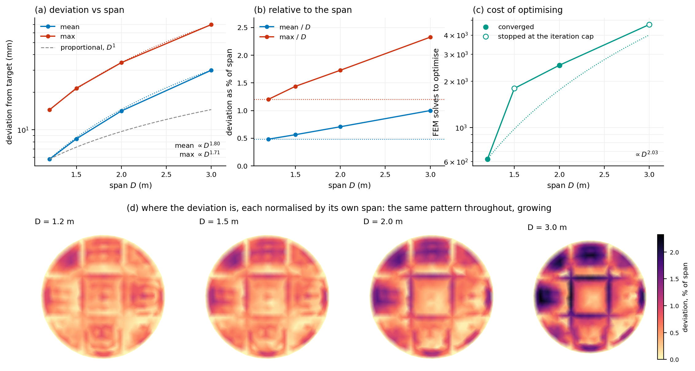

# 6.5.2 Scalability

Everything in Section 6.4 was designed and built at the scale of a laboratory specimen. The question this section asks is what changes when the same design is built larger. It is not whether a bigger shell deviates further from its target in millimetres — everything about it is bigger, so it would be surprising if it did not — but whether it deviates further in proportion, and what that costs to establish.

The free-form shell of Section 6.4.2 was optimised at four spans, 1.2, 1.5, 2.0 and 3.0 m, against a target scaled with the span so that the intended shape is the same shape throughout. The mesh is held at 497 vertices and 929 faces, the material at motif 1, the pressure at 1000 Pa and the region partition at nine, so the only thing that varies is size. Each run was re-solved afterwards at its own optimum, and the deviations reported here are measured from that verification solve rather than from the optimiser's internal record.

| span D (m) | mean deviation (mm) | max deviation (mm) | mean / D | max / D | FEM solves | course tension (N/m) |
|---|---|---|---|---|---|---|
| 1.2 | 5.8 | 14.4 | 0.48% | 1.20% | 622 | 663 |
| 1.5 | 8.5 | 21.6 | 0.56% | 1.44% | 1800 * | 763 |
| 2.0 | 14.2 | 34.6 | 0.71% | 1.73% | 2546 | 915 |
| 3.0 | 30.0 | 69.8 | 1.00% | 2.33% | 4687 * | 1189 |

*Table 6.W: The free-form shell of Section 6.4.2 optimised at four spans against a target scaled with it. Deviations are over the 434 interior vertices of the 497, the boundary being clamped and carrying no signal. Course tension is the mean over the surface at the optimum. Entries marked * stopped at the optimiser's iteration cap rather than at convergence, so their deviations are upper bounds on what the method achieves and their solve counts are censored.*

## The fit degrades faster than the structure grows

The mean deviation rises from 5.8 mm at 1.2 m to 30.0 mm at 3.0 m. That is a factor of 5.2 for a factor of 2.5 in span, so the deviation is not proportional to the size of the structure: fitted as a power law it goes as D^1.80, and the maximum as D^1.71. Figure 6.31a shows both against the proportional line.

Stated the way a client would ask it, the same fact is that accuracy relative to the span gets worse with span. The mean deviation is 0.48% of the span at 1.2 m and 1.00% at 3.0 m; the maximum grows from 1.20% to 2.33%. A design tolerance written as a fraction of span — the natural way to write one — is therefore harder to meet at every increase in size, by roughly D^0.80.

## Where the error is, and what that says about its cause

The obvious explanations are that the fabric is being stretched further at larger spans, or that the optimiser is running out of parameter range, and neither survives contact with the runs. The stretch factors stay between 1.041 and 1.053 at every span, nowhere near the bounds of [0.95, 1.4] the optimisation is allowed, so the parameterisation is not saturating. The crown height, meanwhile, gets relatively closer to its target as the span grows, from 18.5% of span against an intended 19.3% at the smallest scale to 19.1% at the largest. Whatever is going wrong is not going wrong at the crown, and it is not the fabric running out of stretch.

Figure 6.31d locates it. The deviation field is plotted at each span, each normalised by its own span so the patterns may be compared, and it is the same pattern throughout — a grid of nine cells with the error concentrated in the seams between them and in the four side lobes. That grid is the region partition. The surface is fitted with nine piecewise-constant pairs of stretch factors, and what the fit cannot express is the variation within a region and the discontinuity at its edge. Scaling the structure does not change that pattern; it magnifies it, because the same relative shape error over a longer edge is a larger absolute one, and because the curvature the fabric must produce inside each cell grows with the cell.

This is a more useful answer than a scaling exponent on its own, because it names the lever. The way to build this shape larger without losing proportional accuracy is not a stiffer fabric or a higher pressure but a finer partition — more regions, or regions placed where the seams currently fall. Section 6.4.6 already shows what that costs on a different geometry: going from four regions to ten reduced the deviation while roughly halving the evaluations needed, once the regions were aligned with the directional field rather than grown adaptively.

## What it costs to establish

The optimisation cost grows as D^2.03, from 622 forward solves at 1.2 m to 4687 at 3.0 m. Nothing in the problem gets bigger in the numerical sense — the mesh, the design vector and the solver tolerances are identical at every span — so this is not the cost of a larger discretisation. It is the cost of a harder optimisation: as the target moves further out of reach of the parameterisation, the objective flattens and the finite-difference gradient has less to work with, and L-BFGS-B takes more iterations to make less progress. At 0.13 s a solve, from the timings of Section 6.5.1, the largest run is about ten minutes, so this is a limit on patience rather than on feasibility.

Two of the four runs, at 1.5 and 3.0 m, stopped at the optimiser's iteration cap rather than at convergence. Their deviations are therefore upper bounds on what the method achieves at those spans, and their solve counts are censored from below. The exponents above should be read with that in mind: the true degradation may be gentler than D^1.80 and the true cost steeper than D^2.03. Re-running the two capped spans to convergence is the single thing that would firm up this section, and at ten minutes a run it is cheap.

## What scales, and what does not

Three quantities behave differently as the span grows, and separating them is the practical result of this section. The intended shape scales exactly, by construction. The membrane tension scales sub-linearly: the mean course tension rises from 663 to 1189 N/m over a 2.5-fold span, so a fabric qualified at the specimen scale is not immediately disqualified at the larger one, though the margin against the material's usable range narrows and should be checked against Chapter 4 rather than assumed. And the achievable accuracy scales adversely, as D^1.80.

So the workflow scales in the sense that matters least — it runs, and it produces a design — and fails to scale in the sense that matters most, which is that the design gets proportionally worse. The remedy is known and is a design decision rather than a fabrication one: refine the partition as the structure grows, and expect the number of regions needed to hold a fixed relative accuracy to rise with span. Establishing that relation — regions required against span, at fixed accuracy — is the natural continuation of this study and is not attempted here.

*Figure 6.31: The free-form shell at four spans. All three upper panels share one linear span axis. (a) Mean and maximum deviation against span, logarithmic in the deviation, with the fitted power laws and the proportional line for comparison; both grow faster than the span. (b) The same normalised by span, which is how a tolerance would be written: relative accuracy worsens throughout. (c) Optimisation cost, quadratic in the span, with the two runs that stopped at the iteration cap shown hollow. (d) The deviation field at each span, each normalised by its own span: the same nine-cell pattern of the region partition throughout, magnified rather than changed.*

# Notes for revision — not part of the section

Every number above is read from data/scalability.json, which figure_scalability.py computes from the stored verification solves (optimisation/check_<tag>_verts.csv) against the scaled targets (data/B5_remeshed_shared*.off), over the interior-vertex index data/B5_remeshed_interior_idx.npy. Solve counts and tensions come from optimisation/B5_multiscale_summary.json. Re-run the figure script and rebuild and the section follows.

1. Two of four runs are capped, at 1.5 and 3.0 m. This is the weakest point of the section and it is cheap to fix: about ten minutes of compute each at the Section 6.5.1 solve cost. Until then the exponents are indicative rather than measured.

2. Four spans over a 2.5-fold range is a short lever arm for a power law. The fitted exponents are reported to two decimals because that is what the fit returns, not because the data supports that precision; 'grows roughly as the square of the span' is the honest reading of the cost, and 'faster than proportionally, close to D^1.8' of the deviation.

3. The mechanism in Figure 6.31d is an interpretation, well supported by the pattern matching the partition but not demonstrated. The demonstration is a re-run at one span with a finer partition: if the deviation falls and the pattern subdivides accordingly, the reading is confirmed. That experiment would also give the regions-against-span relation the closing paragraph says is missing.

3a. The crown-height panel has been removed from Figure 6.31, and the three remaining upper panels put on one linear span axis so they read against the same scale; (a) and (c) keep a logarithmic vertical axis, so the fitted power laws now appear as curves rather than as straight lines. The crown-height claim in the second paragraph of 'Where the error is' therefore no longer has a panel behind it. The numbers are still in data/scalability.json, as crown_ratio and target_crown_ratio, but a reader of the section has to take them on trust. Either quote both endpoints in the sentence or drop the claim.

4. The section numbering follows the thesis: 6.5.1 computational time, 6.5.2 this, 6.5.3 robustness. Figure 6.31 here means the figures of 6.5.3 shift to 6.32 onward; both build scripts should be renumbered together once the chapter's figure list is settled.

5. Tension is reported as the surface mean. If the fabric's usable range is to be checked at 3.0 m, the maximum matters more: it reaches 1755 N/m in course at the largest span against 908 N/m at the smallest. Whether that is inside the qualified range is a Chapter 4 question this section does not answer.
