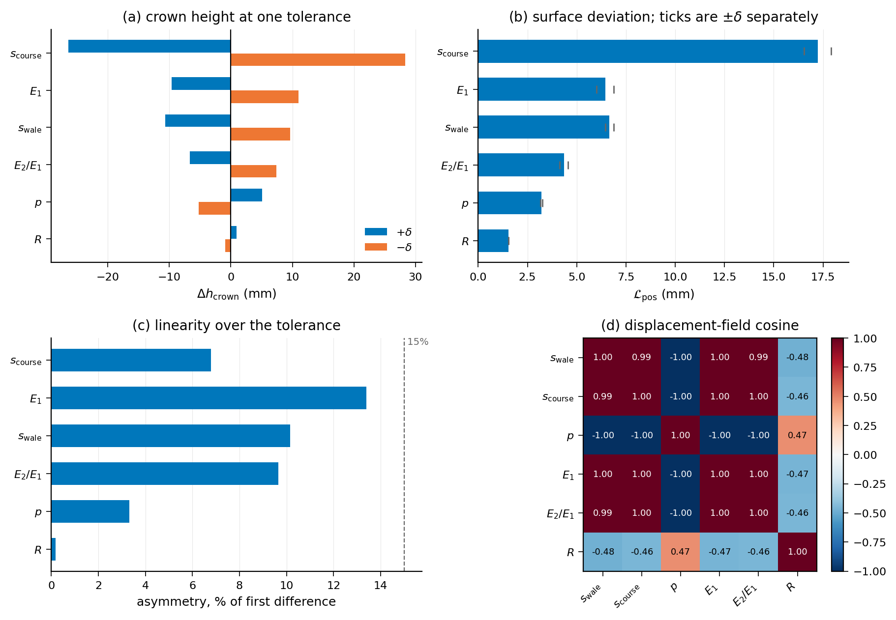
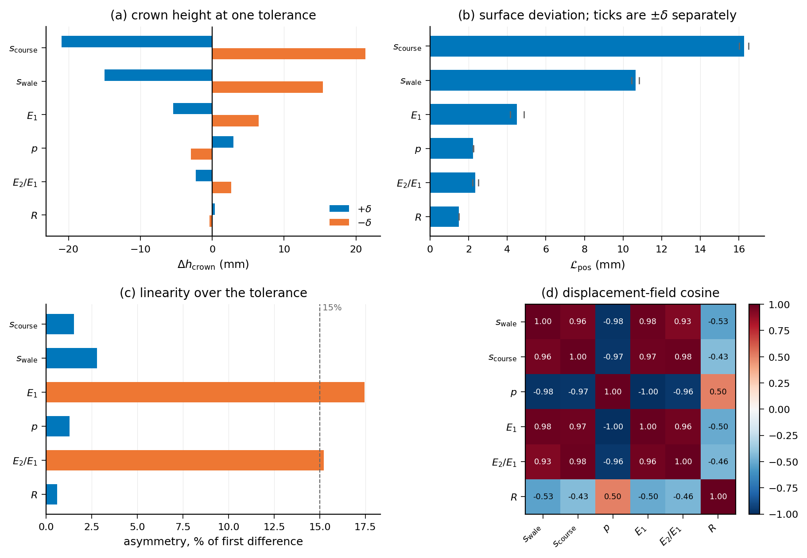
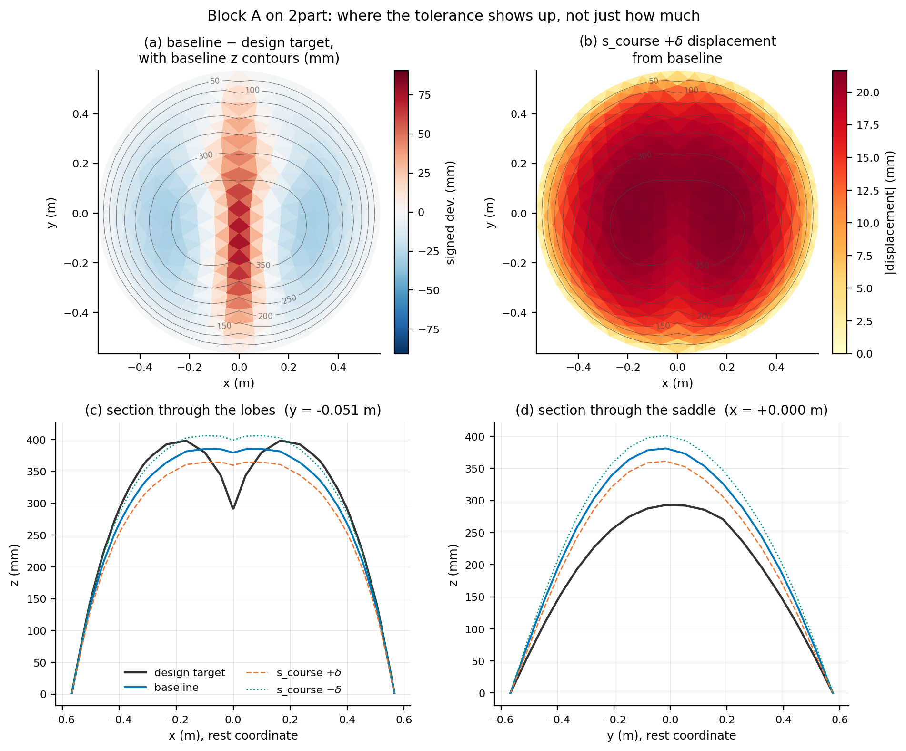
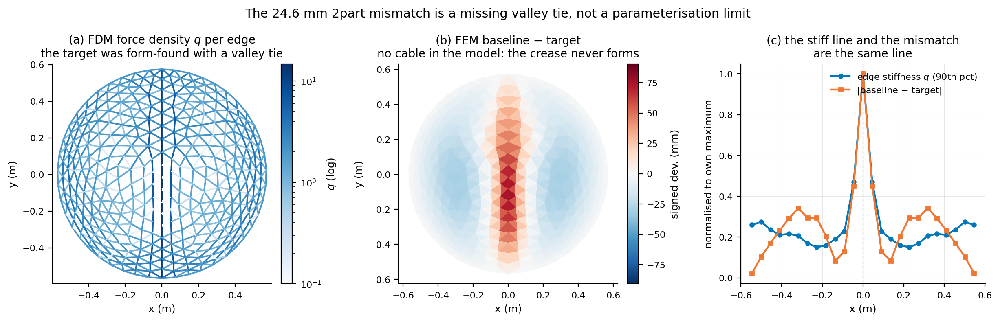

# 6.5.3 Robustness to construction imprecision

The design of Section 6.4 is computed from nominal values: a stretch factor the knitting is asked to deliver, a membrane stiffness measured on coupons, an inflation pressure held by a regulator, a boundary ring cut to a drawing. The built structure has none of these exactly. This section asks how far the inflated equilibrium moves when they are wrong by as much as fabrication can be expected to leave them wrong, and, where the geometry carries a design target, whether that movement matters against the error the design already has.

Six factors are perturbed one at a time by plus and minus one tolerance about a nominal working point: the two stretch factors s_wale and s_course, the membrane stiffness E1, the orthotropy ratio E2/E1, the inflation pressure p, and the boundary radius R. Thirteen solves per geometry — a baseline and twelve perturbations — on two geometries. The circular dome of Section 6.2 serves as the method check: it has a flat rest mesh and no design target of its own, so its deviations are referenced to its own baseline equilibrium. The creased shell of Section 6.4.1 is the case that carries a target, and is where the question of what the tolerances mean can actually be answered.

## How the responses are measured

Two outputs are reported for each perturbation. The crown height is a scalar and admits the usual first-order treatment: a central difference gives the half-range, and an elasticity, the relative change in crown height per relative change in the factor, makes the six comparable across their different units. L_pos is the RMS displacement of the surface from the baseline equilibrium, taken over interior vertices only. The boundary is clamped, so its deviation is zero by construction and including it would deflate every figure by an amount set by nothing but boundary discretisation.

The nominal for the creased shell is not free to be chosen. Its rest mesh is the shape the structure is meant to hold, so the stretch factors are whatever puts the inflated equilibrium on that shape, and they are fitted. The anisotropic two-parameter fit saturates at both bounds, s_wale to 1.400 and s_course to 0.950, which is a result in itself — a uniform pre-strain cannot reach this target — but it is unusable as a nominal, since a working point on a bound cannot be perturbed symmetrically and the plus and minus responses would differ because one side was clipped rather than because the physics is asymmetric. The isotropic fit is interior at s = 1.1171, and that is the working point used here. It leaves a standing mismatch of 24.6 mm before any imperfection is applied.

The numerical floor was measured rather than assumed. Re-solving the baseline along a different stretch-factor continuation path reproduces it to below 0.01 um in both outputs, at the 1e-8 m precision of the solver's output. Every response reported below is physical by five orders of magnitude.

## The circular dome

| factor | tolerance | crown, +d (mm) | crown, -d (mm) | half-range (mm) | elasticity | asymmetry | L_pos (mm) |
|---|---|---|---|---|---|---|---|
| s_course | 0.05 | -26.45 | +28.31 | -27.38 | -3.67 | 6.8% | 17.23 |
| E1 | 500 N/m | -9.64 | +11.02 | -10.33 | -0.63 | 13.4% | 6.45 |
| s_wale | 0.05 | -10.64 | +9.61 | -10.12 | -1.36 | 10.2% | 6.67 |
| E2/E1 | 0.250 | -6.71 | +7.38 | -7.05 | -0.43 | 9.6% | 4.36 |
| p | 50 Pa | +5.06 | -5.23 | +5.14 | +0.63 | 3.3% | 3.21 |
| R | 5 mm | +2.23 | -2.23 | +2.23 | +1.63 | 0.4% | 3.82 |

*Table 6.Y: Block A on the circular dome. Crown-height response to one tolerance either side of the nominal, sorted by effect. Elasticity is the relative change in crown height per relative change in the factor; asymmetry is the difference between the two signs as a fraction of the first difference, and a value under 15% means the response may be rescaled to a different tolerance without re-running. L_pos is the RMS surface displacement from the baseline over interior vertices.*

The predicted spread with all six factors at one tolerance is 32.2 mm RSS in crown height, 19.6% of the 164.2 mm the dome rises, and 62.2 mm if every error happens to align. Three things in the table are worth drawing out.

s_course dominates, at 2.7 times the next factor, because the course direction is the stiff one — E2 is 2.5 times E1 — so pre-strain applied along it does the most work. It is also the factor whose tolerance is the least well known, which is where the uncertainty in this study sits.

R has the second-largest elasticity at +1.63 and nearly the smallest effect, purely because its tolerance is tight: 0.8% of the nominal, against 4.5 to 10% for the others. It is a factor worth controlling precisely rather than one that does not matter, and the distinction is only visible because elasticity and effect are reported separately.

The six factors are very nearly degenerate on this geometry. The median absolute cosine between their displacement fields is 0.996 off the diagonal, and p / E1 sit at -1.000. They excite one and the same axisymmetric inflation mode, differing in sign and amplitude but not in shape. Two consequences follow. A measured deviation cannot be attributed to a factor by this block, only bounded in size; attribution needs a geometry on which the fields separate. And a joint sampling of all six would give a broad, right-skewed distribution of L_pos with a mean below the RSS, because near-parallel contributions add and cancel algebraically. The crown-height RSS is unaffected by this: for a scalar output RSS is correct whenever the factor errors are independent, whatever the shape of the response.

## The creased shell

| factor | tolerance | crown, +d (mm) | crown, -d (mm) | half-range (mm) | elasticity | asymmetry | L_pos (mm) |
|---|---|---|---|---|---|---|---|
| s_course | 0.05 | -20.99 | +21.31 | -21.15 | -1.22 | 1.5% | 16.26 |
| s_wale | 0.05 | -14.97 | +15.40 | -15.18 | -0.88 | 2.8% | 10.64 |
| E1 | 500 N/m | -5.44 | +6.48 | -5.96 | -0.15 | 17.5% | 4.51 |
| p | 50 Pa | +2.94 | -2.98 | +2.96 | +0.15 | 1.3% | 2.24 |
| E2/E1 | 0.250 | -2.27 | +2.64 | -2.45 | -0.06 | 15.2% | 2.35 |
| R | 5 mm | +0.94 | -0.93 | +0.93 | +0.28 | 1.5% | 3.74 |

*Table 6.Z: Block A on the creased shell, about the fitted isotropic nominal. Same columns. E1 at 17.5% and E2/E1 at 15.2% exceed the linearity threshold, so those two rows should not be rescaled.*

The predicted spread is 27.0 mm RSS, similar in absolute terms to the dome's but only 7.0% of the crown height here against 19.6% there, because this shell is more than twice as tall. The ordering of the six is the dome's with a single swap, s_wale overtaking E1, so the dominant tolerance does not change with geometry — at least between these two, and before cables and multiple regions enter.

## What the target adds

The creased shell can answer a question the dome cannot, because it has a design target to be wrong about. The standing mismatch at the nominal is 24.6 mm. The largest single tolerance, s_course, adds 16.3 mm on top of it. The tolerances are therefore not the binding error, and the two are not merely different in size but in kind: the cosine between the mismatch field and the s_course displacement field is +0.006, orthogonal to three decimal places.

Figure 6.33 shows what that means on the surface. The mismatch is a narrow stripe along x = 0 reaching 91 mm: the target has a sharp crease between its two lobes, and the section through them has the target dipping to 292 mm at the valley while the equilibrium runs flat across at 380 to 385 mm. The tolerance perturbation, by contrast, is a broad smooth mode that lifts or drops the whole cap by about 20 mm and does nothing at the valley. No tightening of these six tolerances moves this shape toward its target.

Figure 6.34 says why, and corrects the obvious reading. The natural conclusion from the saturated anisotropic fit is that a uniform two-parameter pre-strain is too poor a parameterisation to form a crease. That is not what happened. The target was form-found with a tie along the valley — the force densities of the form-finding carry a stiff line exactly along x = 0 — and the finite-element model has no cable there. The stiff line of the form finding and the stripe of the mismatch are the same line. The crease is missing from the simulation because the element that creates it was not carried across from the form finding, not because the stretch-factor field is too coarse to express it. The fix is to model the valley tie, and only then to ask whether the parameterisation is rich enough.

One further caution on reading the table for this geometry. L_target is stationary in the stretch factors at the nominal, because the nominal is a fitted minimum: both signs make it worse, by 4.84 and 4.89 mm. A central difference at an optimum is second order and therefore near zero and meaningless, so the analysis reports the increase instead. In the directions that were never fitted — E1, p and R — one sign does improve L_target, as it should.

## What this establishes, and what it does not

Within the tolerances assumed, construction imprecision moves the crown height by about 20% on the dome and 7% on the creased shell, and the surface by 21 and 21 mm RMS respectively. On the geometry that has a target, that is smaller than and geometrically unrelated to the error the model already carries. The practical reading is that for this case study fabrication tolerance is not the limiting factor on how closely the built shape matches the design, and effort is better spent on the model than on the workshop.

Three limits should be stated with equal clarity. All six tolerances are estimates; none is yet backed by a measurement, and the dominant one, the stretch factor, is the one with no measurement behind it at all. Replacing an estimate does not require re-running provided the response is linear over the tolerance, which the block checks by the asymmetry between the plus and minus responses: on the dome the worst is 13.4% (E1), inside the 15% threshold, so the responses rescale; on the creased shell E1 reaches 17.5% and E2/E1 15.2%, so those two rows do not rescale safely and want a smaller-delta re-run once the material scatter is known. The stretch-factor rows, at 1.5 to 2.8%, are solidly linear on both — which is the important case, since that is the estimate most likely to be revised.

The perturbations here are uniform: a single stretch factor wrong everywhere, a single radius wrong everywhere. Real imprecision is also non-uniform, and the two need not have the same effect. The reference dome makes the point by accident — its boundary vertices run between 597.8 and 600.0 mm, a 2.2 mm out-of-round span at 0.58 mm standard deviation, which is 22% of the radius tolerance being tested. The nominal baseline already carries an out-of-round imperfection comparable to the tolerance under test, so a dedicated out-of-round study has to be measured against this mesh's existing scatter rather than against a perfect circle.

And this is one geometry perturbed one factor at a time about a single-region, cable-free model. The case study of Section 6.4.6 is multi-region and carries cables, whose rest length is a tolerance of its own and a quantised one, set by the resolution of a turnbuckle rather than by a Gaussian. Independent per-region draws, and a joint sampling that lets the factors interfere, remain to be run.

*Figure 6.31: Block A on the circular dome. (a) Crown-height response to plus and minus one tolerance, sorted by effect. (b) Surface deviation L_pos, with the two signs shown separately as ticks. (c) Asymmetry between the two signs, against the 15% linearity threshold. (d) Pairwise cosine between the per-factor displacement fields: the six are nearly the same mode, and p and E1 are exactly opposed.*

*Figure 6.32: Block A on the creased shell, the same four panels. The ordering of the factors is the dome's with one swap, but E1 and E2/E1 exceed the linearity threshold here, so those two rows do not rescale to a different tolerance.*

*Figure 6.33: Where the tolerance shows up, rather than how much. (a) The standing mismatch between the baseline equilibrium and the design target is a narrow stripe along the valley. (b) The dominant tolerance moves the whole cap smoothly and does nothing at the valley. (c) The section through the lobes: the target creases to 292 mm where the equilibrium runs flat at 380 to 385 mm. (d) The section through the saddle, where the perturbation acts and the mismatch does not.*

*Figure 6.34: The standing mismatch is a missing valley tie, not a limit of the parameterisation. (a) The force densities of the form finding carry a stiff line along x = 0. (b) The finite-element model has no cable there, so the crease never forms. (c) The stiff line and the mismatch are the same line.*

# Notes for revision — not part of the section

Every number above is read from the Block A outputs by build_section_6_5_3.py: the per-factor responses from data/block_A_{disc,2part}_sensitivity.csv, and the spreads, cosines and out-of-round figures from data/block_A_overlap.json, itself produced by analyse_block_A.py --check-overlap and plot_shape.py. Re-run those and rebuild and the section follows.

1. The tolerances are estimates. tolerances.py records the source each one waits on. Until they are measured every magnitude in this section is conditional, and that should be said in the text as well as here if the section goes out before the measurements come in.

2. Two scripts disagree about the standing mismatch. analyse_block_A.py reports L_target = 24.59 mm; plot_shape.py prints 20.65 mm RMS for what reads as the same quantity. The difference is that plot_shape averages over all vertices while the analysis restricts to interior ones, and the clamped boundary deflates the former. The section uses 24.59 mm. Worth making plot_shape mask the boundary so the two agree.

3. Figure numbers 6.31 to 6.34 are provisional and assume 6.29 and 6.30 belong to Section 6.5.1.

4. Blocks B to E are not built. B adds Poisson's ratio and cable rest length at the case-study optimum and needs the n-region binary; C draws per-region and per-cable independently; D samples jointly and reports the distribution of L_pos against the RSS predicted here; E repeats B on a second geometry. Block A already answers part of E's question — the dominant tolerance is s_course on both geometries — so E is testing whether that survives cables and regions.

5. Section 6.4 currently gives one scan, so comparing a measured deviation against this predicted spread compares a distribution with a point. Two specimens from the same knit programme, or one specimen re-scanned after re-inflation, would make the comparison two-sided.
