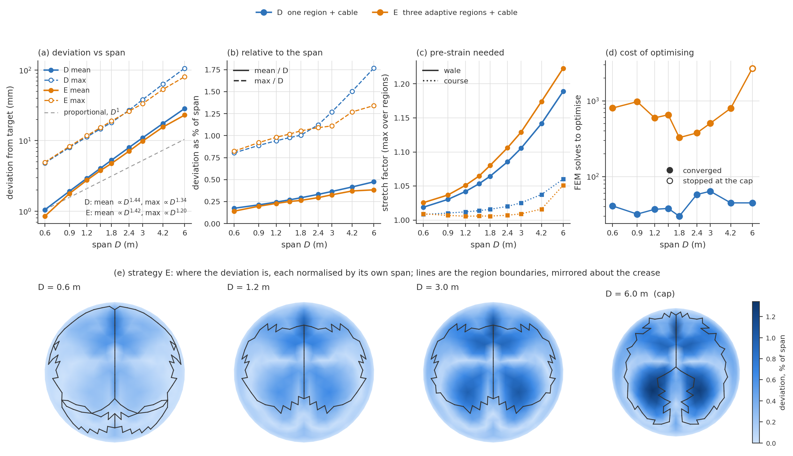

# 7.5.2 Scalability

Everything in Section 7.4 was designed and built at the scale of a laboratory specimen. The question this section asks is what changes when the same design is built larger. It is not whether a bigger shell deviates further from its target in millimetres — everything about it is bigger, so it would be surprising if it did not — but whether it deviates further in proportion, what the fabric has to do differently to hold the shape, and what that costs to establish.

The shell with the middle crease of Section 7.4.1 was re-optimised from scratch at nine spans between 0.6 and 6.0 m, against a target scaled with the span so that the intended shape is the same shape throughout. Two of its strategies were carried through: D, one anisotropic pre-strain over the whole surface with the crease cable, and E, three regions whose boundaries are adapted during the optimisation, also with the cable. The mesh is held at 341 vertices and 634 faces, the material at stitch structure I and the pressure at 1000 Pa; the cable's axial stiffness is scaled with the span, as a cable sized for the larger structure would be. This case was chosen over the free-form shell of Section 7.4.3 because it is cheap enough to run every span to convergence, which turns out to be the condition for the result to mean anything (see the last part of this section).

| span D (m) | D mean (mm) | D max (mm) | D mean / span | E mean (mm) | E max (mm) | E mean / span | D solves | E solves |
|---|---|---|---|---|---|---|---|---|
| 0.6 | 1.05 | 4.8 | 0.17% | 0.85 | 4.9 | 0.14% | 41 | 803 |
| 0.9 | 1.92 | 8.0 | 0.21% | 1.78 | 8.3 | 0.20% | 32 | 974 |
| 1.2 | 2.93 | 11.3 | 0.24% | 2.75 | 11.8 | 0.23% | 37 | 596 |
| 1.5 | 4.06 | 14.7 | 0.27% | 3.77 | 15.3 | 0.25% | 38 | 654 |
| 1.8 | 5.29 | 18.1 | 0.29% | 4.75 | 19.0 | 0.26% | 30 | 327 |
| 2.4 | 7.98 | 27.0 | 0.33% | 7.09 | 26.2 | 0.30% | 58 | 376 |
| 3.0 | 10.95 | 38.1 | 0.37% | 9.83 | 33.3 | 0.33% | 64 | 505 |
| 4.2 | 17.51 | 63.2 | 0.42% | 15.59 | 53.3 | 0.37% | 45 | 798 |
| 6.0 | 28.51 | 106.1 | 0.48% | 23.03 | 80.5 | 0.38% | 45 | 2688 * |

*Table 7.W: The shell with the middle crease optimised at nine spans against a target scaled with it, for strategy D (one region) and strategy E (three adaptive regions), both with the crease cable. Deviation is the Section 7.4 measure, the distance from each simulated vertex to the nearest point on the target, over all vertices. The entry marked * stopped at the cap of 20 alternating iterations with faces still being reassigned; every other run converged.*

## The fit degrades faster than the structure grows

Over the tenfold range of span the mean deviation of strategy D rises from 1.05 to 28.5 mm, a factor of 27. Fitted as a power law it goes as D^1.44, and the maximum as D^1.34; strategy E follows almost the same law in the mean, D^1.42, and a gentler one in the maximum, D^1.20 (Figure 7.31a). The exponent is not an artefact of the fit's end points: fitted over the five smallest spans alone it is 1.47, and over the five largest 1.40.

Stated as a tolerance would be written, accuracy relative to the span gets worse with span. The mean deviation of D is 0.17% of the span at 0.6 m and 0.48% at 6.0 m; its maximum grows from 0.80% to 1.77% (Figure 7.31b). Nothing in the problem changes but the size, so this is a property of the method and the material, not of a particular run.

## Why: the pre-strain has to grow with the span

Pressure and material are fixed while the span grows, so the shell is not a scaled copy of itself. The membrane tension needed to carry a given pressure over a given curvature grows with the radius of curvature, and with the material held constant the strain the fabric must take up grows with it. The optimiser finds exactly this. The wale stretch factor of strategy D rises from 1.019 at 0.6 m to 1.189 at 6.0 m (Figure 7.31c), a wale pre-strain of 3.1 to 3.6% per metre of span at every span tested — close to proportional to the span, as the membrane argument predicts. The course stretch factor barely moves until about 4 m and then rises, from 1.008 to 1.060.

A single pre-strain pair can be chosen to place the crown, but it cannot place every part of the surface at once, and the part it cannot place grows with the strain it has to provide: a uniform pre-strain of 19% over a 6 m shell leaves a larger residual, in proportion, than one of 2% over a 0.6 m shell. That residual is what panels (a) and (b) measure. The deviation therefore grows as roughly D^1.4 rather than D^1 because the strain the fabric is asked for grows with D, and the misfit grows with the strain.

## Regions help more as the span grows

At the specimen scale the three adaptive regions of strategy E are barely better than one region: 2.75 against 2.93 mm in the mean at 1.2 m, and slightly worse in the maximum. The gap opens with size. At 6.0 m E's mean deviation is 0.38% of span against D's 0.48%, and its maximum 1.34% against 1.77%. The regions buy accuracy where the strain demand is high, which is at large span; at small span there is little non-uniformity in the needed strain for them to express.

Figure 7.31e shows where. At 0.6 m the residual of strategy E sits along the crease and the region boundaries follow it. By 3.0 m it has moved into the two southern lobes, and at 6.0 m it is concentrated there, with the third region, which carries the highest wale stretch factor (1.22 at 6.0 m), grown to cover them. The pattern of the error is therefore not fixed and magnified with size: it changes, because the parts of the surface that are hardest to fit change as the strain demand grows. A partition chosen at the specimen scale is not the right partition at the building scale, and an adaptive one follows the change at the cost of more iterations.

## What it costs to establish

Strategy D is cheap at every span: 30 to 64 forward solves, with no trend in the span, and a few seconds of wall clock per run. With two design variables and a well-conditioned objective, the size of the shell does not make the optimisation harder.

Strategy E costs ten to twenty times more, 327 to 974 solves up to 4.2 m, and its cost rises at the largest span, where the reassignment of faces between regions keeps finding improvements: at 6.0 m it was still reassigning faces after 20 alternating iterations and 2688 solves, about 19 minutes. Its result at that span is therefore an upper bound on what the adaptive strategy achieves, and its cost is censored from below.

Both drivers stop when an L-BFGS iteration leaves every stretch factor unchanged to 10^-5 in the logarithm, rather than at a gradient threshold. The finite-difference gradient has a noise floor of about 5×10^-4 at 1.2 m, above the gradient threshold the 7.4.1 drivers used, so without that rule the optimiser does not stop at the optimum but spends its remaining iterations on failed line searches. The rule is independent of scale, which a gradient threshold is not, and at 1.2 m it reproduces the 7.4.1 optima exactly.

The same study on the free-form shell of Section 7.4.3 (nine regions, twelve cables, four spans from 1.2 to 3.0 m) is not conclusive: three of its four runs stopped at the iteration cap, so its deviations and costs record where each optimiser stopped rather than how the problem scales, and they moved substantially between the runs before and after the pressure correction of Section 7.4. Its deviations as a fraction of span, 0.34 to 0.41% in the mean, are of the same order as those found here.

## What scales, and what does not

The intended shape scales exactly, by construction. The pre-strain the fabric must provide does not: it grows nearly in proportion to the span, from 2% at 0.6 m to 19% in the wale at 6.0 m, and that rather than the optimisation is what limits the result. The achievable accuracy scales adversely, as about D^1.4 in millimetres, D^0.4 relative to the span. And the cost of finding the design scales well for a single region and less well for adaptive regions.

So the workflow scales in the sense that it runs and produces a design at every span, and it does not scale in the sense that the design gets proportionally worse and asks more of the fabric. The two levers are both design decisions. A finer or better-placed partition recovers part of the accuracy, and recovers more the larger the structure. The pre-strain demand itself can only be reduced by a stiffer fabric, a different stitch structure in the high-strain regions, or a lower pressure; at 6.0 m the wale pre-strain of 19 to 22% is well outside what the Section 7.4 specimens used, and whether the knit can deliver it is a material question this section does not answer.

*Figure 7.31: The shell with the middle crease at nine spans, strategy D (one region, blue) and E (three adaptive regions, orange), both with the crease cable. All upper panels share one logarithmic span axis. (a) Mean (solid) and maximum (dashed) deviation against span, with the fitted power laws and the proportional line for comparison; both grow faster than the span. (b) The same as a percentage of the span, which is how a tolerance would be written. (c) The pre-strain the optimum needs, as the largest wale (solid) and course (dotted) stretch factor over the regions; the wale pre-strain grows nearly in proportion to the span. (d) Optimisation cost in forward solves; the hollow marker stopped at the iteration cap. (e) Strategy E's deviation field at four spans, each normalised by its own span, with the region boundaries in black: the error moves from the crease into the southern lobes as the span grows, and the regions follow it.*

# Notes for revision — not part of the section

Every number above is read from FDM/data/2part_span.json, which FDM/figure_2part_span.py computes from the runs in FDM/optimisation/2part_span/ (written by FDM/run_2part_span.sh) against the 7.4.1 target scaled to each span. Re-run the batch and the figure script and the section follows.

1. Strategy E at 6.0 m stopped at the 20-iteration cap. A rerun with a higher cap would close the last censored entry; it took 19 minutes to reach the cap, so the cost is modest.

2. The 7.4.1 drivers carried a 6-iteration cap for E, and the 7.4.1 E run was capped. The span study used 20 and the stall rule described above, so the 1.2 m row here (596 solves, 2.75 mm) differs from the 7.4.1 E run (406 solves, 3.38 mm by the drivers' own vertex-to-vertex measure). The computational-cost table's row for E ("4 adaptive regions, 6 variables, 554 solves, 11.4 s") matches neither and should be rechecked: the current driver has three regions, two of which share their parameters, so four design variables.

3. "Membrane tension grows with the radius of curvature" is the standard Laplace-law argument and is stated without a calculation. The drivers do not write stress output, so the tension at the optimum is not in this section; if the claim needs a number behind it, fem_batch_nregion can be run at the stored optima with keep_stress.

4. The pre-strain at 6.0 m (19 to 22% in the wale) should be checked against the range over which the stitch structure I calibration was measured. If it is outside it, the 4.2 and 6.0 m results extrapolate the material model and the last paragraph should say so explicitly.

5. Numbering: this file was 6_5_2_scalability.md and is renumbered to follow the chapter (Section 7.4 case studies, Section 7.5 discussion). Figure 7.31 and Table 7.W are placeholders until the chapter's figure list is settled. The free-form-shell figure (FDM/figures/scalability.png, figure_scalability.py) is no longer referenced; it is kept, regenerated from the motif-5 fixed-pressure runs, in case the comparison paragraph is to get its own figure.
